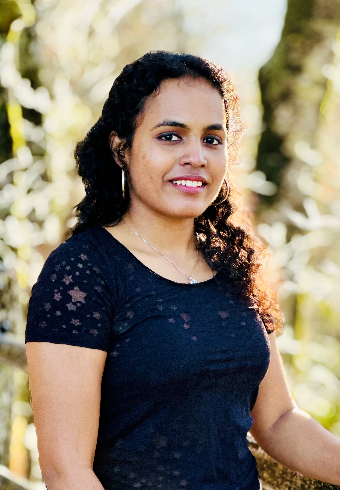

I am Ramya, with 5+ years of experience in software development and data analysis, garnered through diverse projects at Dayforce and Infosys. My proficiency includes programming languages such as Python, SQL, and PL/SQL, along with advanced data visualization tools. I have a deep passion for big data, especially in its use for strategic business decisions.
Beyond work, I’m an avid foodie, like to listen to K-pop and formerly led my volleyball team back in India, where I honed my leadership and teamwork abilities.

