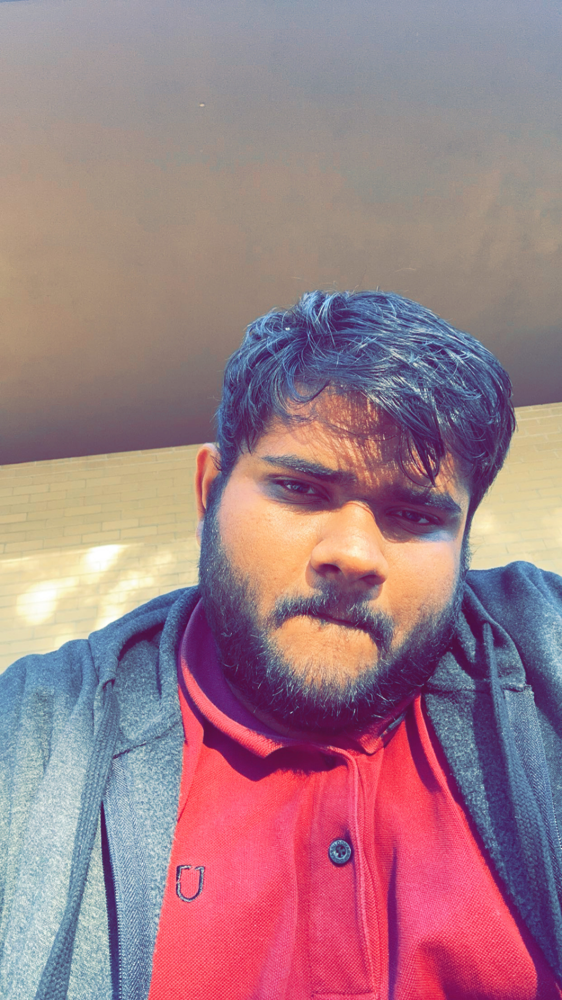

# Ravindranath Katta

## Biography
I'm Ravindranath katta. I completed my undergraduate degree in Computer Science in India and spent two years working as a full-stack developer at Wipro, a multinational corporation. During this time, I gained valuable experience in both front-end and back-end development, allowing me to hone my technical skills. Beyond my academic and professional pursuits, I am passionate about gaming and enjoy spending my free time immersed in Esports, which provides a great outlet for my competitive spirit and love for technology.

## Image

